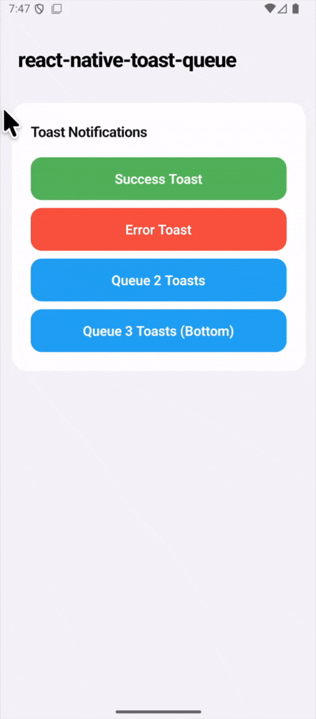

# react-native-toast-queue

A fully type-safe, lightweight, and reusable toast notification system for React Native and Expo. It features a queue system to manage multiple notifications, customizable animations, optional haptic feedback, and a progress bar.

## Demo

<p align="center">
  
</p>

## Features

- 🚀 **Queue-based system**: Toasts wait their turn, ensuring no message is missed.
- 🎨 **4 Types**: Success, Error, Info, Warning.
- ⚡ **Lightweight**: Zero dependencies (optional `expo-haptics`).
- 📱 **Haptic Feedback**: Optional integration with `expo-haptics`.
- ⏳ **Progress Bar**: Visual indicator of remaining time.
- 🎭 **Animations**: Smooth fade and slide animations.
- 🔧 **Type-Safe**: Written in TypeScript with full type definitions.
- ⚛️ **React Native & Expo**: Works seamlessly with both.

## Installation

```bash
npm install react-native-toast-queue
# or
yarn add react-native-toast-queue
```

### Optional: Haptics

If you want haptic feedback, install `expo-haptics`:

```bash
npx expo install expo-haptics
```

## Usage

### 1. Wrap your app with `ToastProvider`

```tsx
import { ToastProvider } from "react-native-toast-queue";

export default function App() {
  return (
    <ToastProvider>
      <YourApp />
    </ToastProvider>
  );
}
```

### 2. Use the hook to show toasts

```tsx
import { useToast } from "react-native-toast-queue";
import { Button, View } from "react-native";

const MyComponent = () => {
  const toast = useToast();

  const handlePress = () => {
    toast.show({
      message: "Hello World!",
      type: "success",
      duration: 3000,
      haptic: true,
      position: "top",
    });
  };

  return (
    <View>
      <Button title="Show Toast" onPress={handlePress} />
    </View>
  );
};
```

## API

### `useToast()`

Returns an object with the following methods:

- `show(options: ToastOptions)`: Adds a toast to the queue.
- `hide()`: Dismisses the current toast immediately.
- `clear()`: Clears the entire queue and dismisses the current toast.

### `ToastOptions`

| Property       | Type                                          | Default      | Description                                                |
| -------------- | --------------------------------------------- | ------------ | ---------------------------------------------------------- |
| `message`      | `string`                                      | **Required** | The message to display.                                    |
| `type`         | `'success' \| 'error' \| 'info' \| 'warning'` | `'info'`     | The visual style of the toast.                             |
| `duration`     | `number`                                      | `3000`       | Duration in milliseconds.                                  |
| `position`     | `'top' \| 'bottom'`                           | `'top'`      | Position on the screen.                                    |
| `haptic`       | `boolean`                                     | `false`      | Trigger haptic feedback on show (requires `expo-haptics`). |
| `showProgress` | `boolean`                                     | `false`      | Show a progress bar indicating remaining time.             |
| `style`        | `ViewStyle`                                   | `undefined`  | Custom styles for the container.                           |
| `textStyle`    | `TextStyle`                                   | `undefined`  | Custom styles for the message text.                        |
| `onPress`      | `() => void`                                  | `undefined`  | Callback when the toast is pressed.                        |
| `icon`         | `ReactNode`                                   | `undefined`  | Custom icon component.                                     |

## Customization

You can customize the look and feel by providing `style` and `textStyle` props in the `show` method options.

```tsx
toast.show({
  message: "Custom Style",
  style: { backgroundColor: "#333", borderRadius: 20 },
  textStyle: { color: "#FFD700", fontSize: 18 },
});
```

## License

MIT
